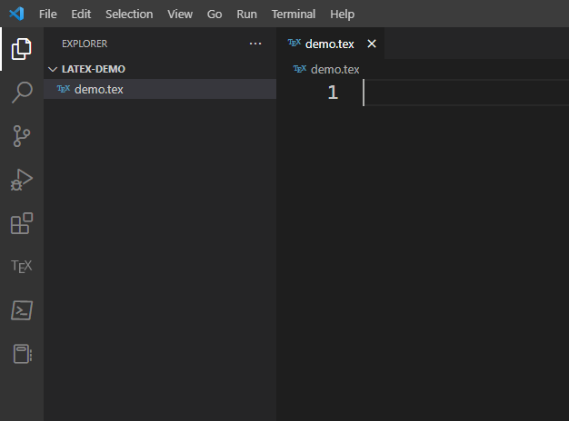
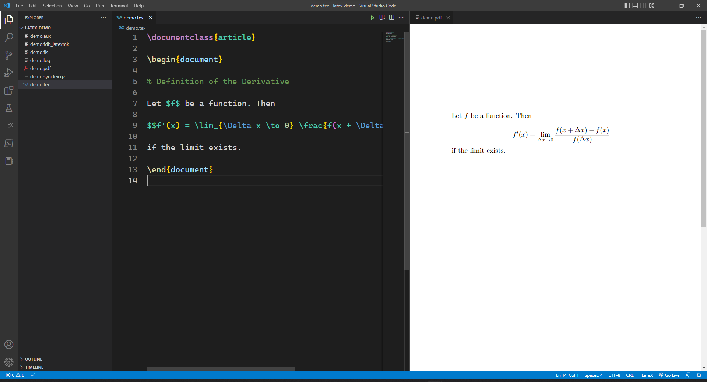

# 在 Windows 下安装 latex

* 以下命令在 PowerShell 中执行 *

1. 下载 scoop

   [https://scoop.sh/](https://scoop.sh/)

   [Scoop](https://github.com/ScoopInstaller/Scoop) 是 Windows 下的 Shell前端软件包管理器，类似 GNU/Linux 中 Debian apt，或 RHEL dnf。Scoop 的[软件许可证](https://github.com/ScoopInstaller/Scoop/blob/master/LICENSE)为共有领域或 MIT。

   ```powershell
   Set-ExecutionPolicy RemoteSigned -Scope CurrentUser
   Invoke-RestMethod get.scoop.sh | Invoke-Expression
   ```

2. 下载 latex 及其依赖项。

   ```powershell
   scoop install miktex
   scoop install perl
   ```

   注：Windows 下 latex 名称被替换为 miktex

3. VSCode 安装插件 `James-Yu.latex-workshop`

   

4. 新建以 `.tex` 结尾的文件。

   

5. 输入以下表达式并保存。

   ```tex
   \documentclass{article}
   
   \begin{document}
   
   % Definition of the Derivative
   
   Let $f$ be a function. Then
   
   $$f'(x) = \lim_{\Delta x \to 0} \frac{f(x + \Delta x) - f(x)}{f(\Delta x)}$$
   
   if the limit exists.
   
   \end{document}
   ```

6. 编译 latex 项目

   点击右上角 "Build LaTeX File" 编译为 PDF 文件。

   点击右上角 "View LaTeX PDF File"，可以查看编译完成的 PDF 文件。

   保存 tex 文件时插件会自动编译，预览的 PDF 文件即时更新。

   
